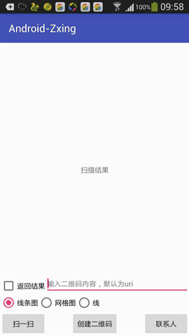

###一、概述

相信Adnroid开发都知道，有四款扫描器，[Zxing](https://github.com/zxing/zxing) 、[Zbar](https://github.com/zbar/zbar) ，[Barcode4J](https://sourceforge.net/projects/barcode4j/files/)、[OkapiBarcode](https://github.com/woo-j/OkapiBarcode) 前二者应用较广泛，至于介绍与区别就在此阐述，网上有很多。此文主要介绍在在使用过程中，官方客户端各种达不到需求。相信很多童鞋都有此体会，所以借此机会就在Zxing 官方客户端基础上修改，去除无用功能并二次封装达到可扩展。
- 官方客户端目前问题汇总
 - 设置功能多余
 - 竖屏后不能正向扫描条形码
 - 扫描框大小、颜色、扫描线配置不够灵活
 - 无生成二维码、主动识别二维码功能
- 介于以上问题，于是该库就华丽的诞生
 - 修复竖屏不能正向扫描条形码
 - 可定制扫描框与扫描线样式
 - 加入创建二维码、识别图片中的二维码功能
  
###二、效果图


###三、[下载APK体验](preview/sample-debug.apk)

###四、引用

## 1、在线
- 本库依赖使用Gradle构建时添加一下即可:

```javascript
compile 'com.mylhyl:zxingscanner:1.2.1'
```

## 2、离线jar，需要手动添加 Zxing 核心库
核心库二种方式：

1、[最新Zxing核心库点击查看](http://jcenter.bintray.com/com/google/zxing/core/)，使用Gradle构建时如下:

```javascript
compile 'com.google.zxing:core:3.3.0'
```

2、本地依赖jar文件使用Gradle命令编译：[gradle makeJar](http://blog.csdn.net/hupei/article/details/51886221) 或者参考下图，在android studio中执行


- [直接下载jar](preview)

###五、使用
直接在`layout xml`使用`ScannerView`即可

```xml
<com.mylhyl.zxing.scanner.ScannerView
    android:id="@+id/scanner_view"
    android:layout_width="match_parent"
    android:layout_height="match_parent" />
```

###### 注意生命周期中的使用
重写`onResume`调用`mScannerView.onResume();`

```java
@Override
protected void onResume() {
    mScannerView.onResume();
    super.onResume();
}

@Override
protected void onPause() {
    mScannerView.onPause();
    super.onPause();
}
```

注册扫描成功监听器`setOnScannerCompletionListener`

```java
/**
 * 扫描成功后将调用
 *
 * @param rawResult    扫描结果
 * @param parsedResult 结果类型
 * @param barcode      扫描后的图像
 */
void OnScannerCompletion(Result rawResult, ParsedResult parsedResult, Bitmap barcode);
```

调用如下方法获取类型

```java
ParsedResultType type = parsedResult.getType();
```

可根据`type`强转为相应的对象，按项目需求处理。每个项目都有不同的需求，所以此库将最终处理结果丢给你们自己咯，想怎么玩就怎么玩，下面代码是在 sample 中

```java
switch (type) {
    case ADDRESSBOOK:
		 AddressBookParsedResult addressBook = (AddressBookParsedResult) parsedResult;
         bundle.putSerializable(Intents.Scan.RESULT, new AddressBookResult(addressBook));
        break;
    case URI:
        URIParsedResult uriParsedResult = (URIParsedResult) parsedResult;
        bundle.putString(Intents.Scan.RESULT, uriParsedResult.getURI());
        break;
    case TEXT:
        bundle.putString(Intents.Scan.RESULT, rawResult.getText());
        break;
}
```

生成二维码使用

```java
//联系人类型
Bitmap bitmap = QREncode.encodeQR(new QREncode.Builder(this)
        .setParsedResultType(ParsedResultType.ADDRESSBOOK)
        .setAddressBookUri(contactUri).build());

//文本类型
Bitmap bitmap = QREncode.encodeQR(new QREncode.Builder(this)
        .setColor(getResources().getColor(R.color.colorPrimary))//二维码颜色
        //.setParsedResultType(ParsedResultType.TEXT)//默认是TEXT类型
        .setContents("我是石头")//二维码内容
        .build());

```

###六、样式设置
<table class="table table-bordered table-striped table-condensed">
<tr>
<td>方法名</td>
<td>说明</td>
<td>默认值</td>
</tr>
<tr>
<td>toggleLight</td>
<td>切换闪光灯</td>
<td>关false</td>
</tr>
<tr>
<td>setMediaResId</td>
<td>设置扫描完成播放声音</td>
<td>无</td>
</tr>
<tr>
<td>setLaserFrameBoundColor</td>
<td>扫描框4角颜色</td>
<td>绿色0xff00ff00</td>
</tr>
<tr>
<td>setLaserFrameCornerLength</td>
<td>扫描框4角长度</td>
<td>15dp</td>
</tr>
<tr>
<td>setLaserFrameCornerWidth</td>
<td>扫描框4角宽度</td>
<td>2dp</td>
</tr>
<tr>
<td>setLaserColor</td>
<td>扫描线颜色</td>
<td>绿色0xff00ff00</td>
</tr>
<tr>
<td>setLaserLineResId</td>
<td>条形扫描线图片资源</td>
<td>无</td>
</tr>
<tr>
<td>setLaserGridLineResId</td>
<td>网格扫描线资源</td>
<td>无</td>
</tr>
<tr>
<td>setLaserLineHeight</td>
<td>扫描线高度</td>
<td>2dp</td>
</tr>
<tr>
<td>setLaserFrameSize</td>
<td>设置扫描框大小</td>
<td>屏幕5/8</td>
</tr>
<tr>
<td>setLaserFrameTopMargin</td>
<td>设置扫描框与屏幕距离</td>
<td>屏幕5/8-状态</td>
</tr>
<tr>
<td>setDrawText</td>
<td> text -> 内容 <br>textSize -> 文字大小 <br>textColor -> 文字颜色 <br>isBottom -> 是否在扫描框下方 <br> textMargin -> 离扫描框间距</td>
<td>text -> 将二维码放入框内，即可自动扫描 <br>textSize -> 16sp <br>textColor -> 白色 <br>isBottom -> true <br> textMargin -> 20dp</td>
</tr>
</table>

### 七、版本更新
> 1.2.1 修复依赖提示`Failed to resolve:Android-Zxing:zxing:3.2.2`的错误

> 1.2.0 生成二维码增加`setAddressBookUri(Uri contactUri)`设置联系人`Uri`方法，更方便的使用

> 1.1.3 重新装饰`ParsedResult`各实现类并`Serializable`

> 1.1.2 修复锁屏`onPause`生命周期没有摧毁，导致`onResume`时抛出`RuntimeException`异常 